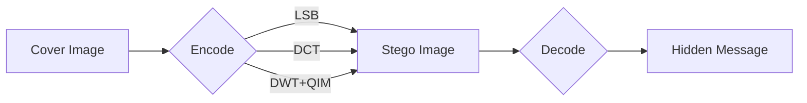

# steganography-toolkit

Steganography toolkit implementing three techniques to hide text inside images: LSB, DCT, and DWT with QIM.

## About

This toolkit was developed as part of my MSc thesis in Artificial Intelligence at Pontificia Universidad Javeriana (Bogota). It implements and compares three steganographic embedding methods with different trade-offs in capacity, robustness, and detectability. Each encoder includes a self-verify mechanism that guarantees no corrupted output is ever written to disk.

Companion repo: [`steganalysis-deep-learning`](https://github.com/sergioarojasm98/steganalysis-deep-learning) -- the detection side, using CNNs and Vision Transformers.

## Stack

| Component | Detail |
|---|---|
| Language | Python 3.8+ |
| Image I/O | OpenCV, Pillow |
| Numerical | NumPy |
| Wavelet | PyWavelets (Haar 2D) |
| CI | GitHub Actions (Python 3.10/3.11/3.12, Ubuntu) |
| Tests | pytest (50 tests, synthetic images) |

## Methods

| Method | Approach | Capacity (480x360) | Round-trip success |
|---|---|---|---|
| **LSB** | Modifies least-significant bit of each RGB channel | ~64,800 chars | 100% |
| **DCT** | QIM on DCT coefficients per 8x8 block | ~1,350 chars | ~67% |
| **DWT** | QIM on Haar wavelet diagonal sub-band + 2-of-3 majority vote | ~1,080 chars | ~90% |



## How to Build / Run

```bash
git clone https://github.com/sergioarojasm98/steganography-toolkit.git
cd steganography-toolkit
python -m venv venv && source venv/bin/activate
pip install -r requirements.txt

# Encode
python lsb/lsb.py -i image.png -o stego.png -m "Secret message"

# Decode
python lsb/decode_lsb.py -i stego.png

# Run tests
pip install -r requirements-dev.txt
pytest
```

Replace `lsb/` with `dct/` or `dwt/` for the other methods. Input images must be PNG; DCT requires dimensions that are multiples of 8.

## License

MIT
